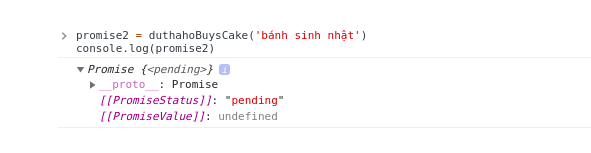
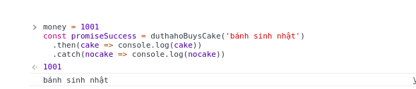
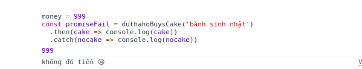

# Tìm hiểu promise trong javascript
#1. Promise là gì?
- Promise là một đối tượng sẽ trả về một giá trị trong tương lai
- Trong JavaScript, một _promise_ được tạo ra như sau:
```.env
    const promise = buysCake('Bánh sinh nhật')
``` 

- Lúc đưa ra promise chúng ta chưa thực hiện nó, lúc đó promise đang ở trạng thái chờ, hay `pending` trong javascript. 
Bạn có thể `console.log` một đối tượng Promise lúc tạo ra để kiểm chứng .
```.env
    console.log(new Promise((rs, rj)=>{}))
    
       # => Promise {<pending>}__proto__: 
            =>    Promise[[PromiseState]]: "pending"
            =>    [[PromiseResult]]: undefined
```
- Bạn có kế hoạch mua bánh, bạn nhịn ăn sáng để dành tiền, tới ngày đó thì ra tiệm bánh để chọn màu chọn loại...
- Nếu đúng ngày bạn có đủ tiền ra tiệm có đúng loại bạn chọn, bạn quyết định mua nó, lúc này lời hứa ở trạng thái đã thực hiện, hay `resolved` trong javascript.
Khi promise ở trạng thái `resolved`, một hành động `.then` được gọi:
```.env
    buysCake('Bánh sinh nhật')
      .then(mang đi chén)
```
- Nhưng cuộc sống không bao giờ cũng 1 màu hồng như thế, bạn muốn chơi lớn làm 1 quả để được nhiều bánh hơn làm vài con 
vietlot, thế là toạch bay hết sạch tiền. Và thế là không mua được cái j cả. Thế là bạn không thực hiện được dự định ban đầu.
Trong javascript chúng ta gọi Promise đang ở trạng thái `rejected`.

- Khi đó bạn thực hiện một kế hoạc dự phòng 1 hành động `.catch` được gọi:
```.env
    buysCake('Bánh sinh nhật')
      .then(mang đi chén)
      .catch(kế hoạch dự phòng)
```
Trong javascript thì chúng ta thường dùng Promise để `get` hoặc `update` dữ liệu. Khi promise ở trạng thái thành công `resolved`, chúng ta xử lý dữ liệu với data trả về.
Ngược lại khi Promise thất bại `rejected`, chúng ta xử lý lỗi:
```.env
    buysCake('Bánh sinh nhật')
      .then(data => {/* xử lý data */})
      .catch(data => {/* xử lý lỗi */})
```

- Đến đây thì bạn đã hiểu promise là gì, các trạng thái của nó và cách nó hoạt động. Hãy cùng tìm hiểu cách tạo ra nó nào.
#2. Cách tạo một promise.
- Tạo một promise khá đơn giản, chỉ cần tạo mới đối tượng Promise `new Promise`. Và hàm contructor của Promise nhận 2 tham số là 2 hàm - `resolved` và `reject`.
```.env
    const promise = new Promise((resolved, reject) => {
        /* Viết cái gì đó*/
    })
```
-  Nếu hàm `resolved` được gọi, trạng thái của promise sẽ thành công và hành động `.then` được gọi.
Tham số truyền vào hàm `resolve` sẽ được chuyển đến `then`:
```.env
    const promise = new Promise((resolved, reject) => {
        // Note: resolve chỉ cho phép truyền đúng 1 param
        return resolved(27)
    })
    
    // Tham số từ resolved sẽ được chuyển đến then.
    promise.then(number => console.log(number))  // 27
```
- Ngược lại nếu hàm `reject` được gọi, trạng thái của promise sẽ là thất bại và hành động `catch` được gọi.
Tương tự như `resolved` tham số được truyền vào `reject` sẽ được chuyển đến `catch`.
```.env
    const promise = new Promise((resolved, reject) => {
      // Note: reject chỉ cho truyền đúng 1 param
      return reject('lỗi')
    })
    promise.catch(err => console.log(err))  // lỗi
```
- Bắt đầu code thôi nào, đầu tiên tạo một promise cho `buysCake` ở trên:
```.env
    const buysCake = cakeType => {
      return new Promise((resolved, reject) => {
        // Do something here
      })
    }
```
- Tiếp theo, lên kế hoạch cho 1 tuần để thực hiện lời hứa. Chúng ta sẽ dùng hàm `setTimeout` để giả sử cho việc chờ đợi và lên kế hoạch.
```.env
    const buysCake = cakeType => {
      return new Promise((resolved, reject) => {
        setTimeout(()=> {
          // Mua hay không mua nào
        }, 1000)
      })
    }
```
**Note:** ở đây `setTimeout` cho 1000ms (1 giây) thôi chớ chờ 1 tuần chắc mỏi răng.
- Nếu 1 tuần sau bạn có tiền mua bánh, promise sẽ gọi `reject` và trả dữ liệu `không đủ tiền` về cho `catch`.
```.env
    let money = 1000
    const buysCake = cakeType => {
      return new Promise((resolve, reject) => {
        setTimeout(() => {
          if (money > 1000) {
            resolved(cakeType)
          } else {
            reject('không đủ tiền rồi ku!')
          }
        }, 1000)
      })
    }
```
- Nếu bạn thử `console.log` với promise dưới đây, kết quả của nó là trạng thái `pending`.
```.env
    const promise = buysCake('bánh sinh nhật')
    console.log(promise)
```

- Giờ bạn sử dụng `then` và `catch` vào promise trên, bạn sẽ thấy kết quả là `bánh sinh nhật` hoặc `không đủ tiền`
phụ thuộc vào số tiền bạn có.
- Trường hợp `then`:
```.env
    money = 1000
    const promiseSuccess = buysCake('bánh sinh nhật')
      .then(cake => console.log(cake))
      .catch(nocake => console.log(nocake))
```

- Trường hợp `catch`:

- Bây giờ bạn có thể dễ dàng tạo ra 1 promise đúng không.
- Nhiệm vụ bây giờ của chúng ta là trả lời câu hỏi - tại sao Promise lại được dùng để thay thế **callback** trong lập trình bất đồng bộ
_asynchronous JavaScript_?
#3. Promises vs Callbacks
- Coder đa số là những thằng làm biếng, tôi cũng thế và chắc bạn cũng vật. Cái gì nhanh, gọn, nhẹ thì chọn vậy thôi.
- Sau đây là 3 lý do mà promise được dùng nhiều hơn là callback:
    - Ít code lồng nhau (nested) hơn
    - Đọc code dễ hiểu hơn
    - Xử lý lỗi dễ dàng hơn với `catch`
- Bài toán ở đay là bạn đang là chủ của 1 cửa hàng bán đồ online, nghề đang hot. Khi đó đặt mua hàng, bạn sẽ lưu lại thông tin của họ và db.
Cuối cùng gửi mail cho họ về đơn hàng thanh toán.
    - Khách hàng đặt mua hàng
    - Lưu lại thông tin khách hàng
    - Gửi mail
- Chúng ta lần lượt đi từng bước. Đầu tiên, khi khách đặt mua hàng, frontend sẽ gửi 1 request mua hàng đến backend kèm theo thông tin của khách hàng, thông thường ở đây là post request.
Ví dụ dưới đây được viết bằng Express - NodeJS framework. Nếu bạn chưa biết cũng sao, chỉ cần quan tâm nó được viết bằng js:
```.env
    // API dùng để frontend gửi request mua hàng đến backend.
    app.post('/buy-thing', (req, res) => {
      const customer = req.body // lấy thông tin khách hàng
    })
```
- Ở đây bạn muốn lấy dữ liệu khách hàng, nếu thành công, bạn lưu thông tin vào db, và sẽ văng ra exception nếu có lỗi.
Ví dụ về sử dụng callback:
```.env
    // Callback based code
    app.post('/buy-thing', (req, res) => {
      const customer = req.body
    
      // lấy dữ liệu khách hàng
      getCustumerInfo(customer, (err, info) => {
        if (err) throw err
    
        // lưu thông tin xuống database
      })
    })
```
- Ví dụ về sử dụng promise:
```.env
    // Promised based code
    app.post('/buy-thing', (req, res) => {
      const customer = req.body
    
      getCustomerInfo(customer)
        .then(info)
        .catch(err => throw err)
    })
```
- Bước 2 là lưu dữ liệu khách hàng xuống db, sau khi lưu thành công, bạn sẽ gửi mail cho khách hàng và ngược lại, văng ra exception nếu lỗi.
- Về sử dụng callback:
```.env
    // Callback based code
    app.post('/buy-thing', (req, res) => {
      const customer = req.body
    
      getCustomerInfo(customer, (err, info) => {
        if (err) throw err
    
        // lưu thông tin xuống database
        addToDatabase(info, (err, document) => {
          if (err) throw err
    
          // gửi email
        })
      })
    })
```
- Sử dụng Promise
```.env
    // Promised based code
    app.post('/buy-thing', (req, res) => {
      const customer = req.body
    
      getCustomerInfo(customer)
        .then(info => addToDatabase(info))
        .then(/* gửi email */)
        .catch(err => throw err)
    })
```
- Cuối cùng khi gửi mail cho khách hàng không thành công, bạn sẽ hiển thị thông báo cho người dùng và ngược lại, văng ra exception.
- VD callback:
```.env
    // Callback based code
    app.post('/buy-thing', (req, res) => {
      const customer = req.body
    
      getCustomerInfo(customer, (err, info) => {
        if (err) throw err
    
        // lưu thông tin xuống database
        addToDatabase(info, (err, document) => {
          if (err) throw err
    
          // gửi email
          sendEmail(customer, (err, result) => {
            if (err) throw err
    
            // thông báo thành công.
            res.send('success!')
          })
        })
      })
    })
```
- Ví dụ về sử dụng promise:
```.env
    app.post('/buy-thing', (req, res) => {
      const customer = req.body
    
      getCustomerInfo(customer)
        .then(info => addToDatabase(info))
        .then(_ => sendEmail(customer) )
        .then(result => res.send('success!')))
        .catch(err => throw err)
    })
```
- Chắc hẳn qua ví dụ trên thì chúng ta đã hình dung được những ưu điểm của việc dùng promise so với callback? Code ngắn gọn, flow dễ hiểu, xử lý lỗi dễ dàng hơn, và quan trọng là tránh phải `callback hell`
khi dùng callback.
#4. Xử lý nhiều promise cùng lúc?
- Một điểm cộng nữa là promise có thể thực hiện nhiều promise cùng lúc mà các hoạt động của chúng không liên quan gì đến nhau,
nhưng kết quả của những lời hứa đó là cần thiết cho 1 hoạt động sau cùng.
- Để làm được điều đó, chúng ta sử dụng hàm `Promise.all`, tham số truyền vào là 1 mảng các promise cần thực hiện.
Khi đó, tham số của `then` chính là 1 mảng chứa các kết quả từ các promise.
- Hãy tưởng tượng bạn muốn ăn bữa tối sau khi nấu đủ 3 món: cơm ,canh, cá. Các hoạt động này thực hiện cùng lúc và 
không phụ thuộc vào nhau, thế nhưng bạn phải chờ cho tất cả nấu xong thì bạn mới ăn tối được.
```.env
    const nauComPromise = nauCom()
    const nauCanhPromise = nauCanh()
    const khoCaPromise = khoCa()
    
    const anToi = Promise.all([
      nauComPromise,
      nauCanhPromise,
      khoCaPromise
    ])
      .then([com, canh, ca] => {
        console.log(`${com} tuyệt vời!`)
        console.log(`${canh} ngon quá!`)
        console.log(`${ca} bị cháy`)
      })
```
- (Ở đây còn 1 hàm `Promise.race`), nhưng hiếm khi được sử dụng.
###5. Kết luận
- Mặc dù trong bài viết nói chúng ta nên sử dụng `promise` để thay thế `callback` nhưng trong 1 số trường hợp cụ thể,
callback vẫn nắm giữ một vai trò quan trọng.

###The end ... 
