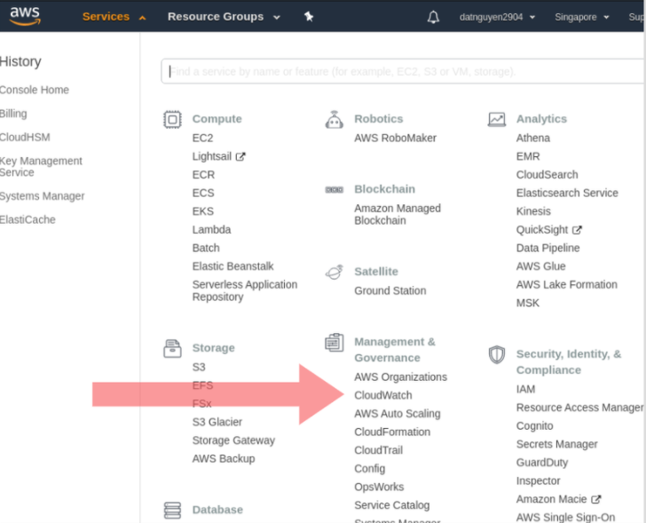

# Kiểm soát chi phí sử dụng AWS
- Lý do:
    - Khi mới dùng thử và sử dụng AWS chúng ta có thể nghịch 1 vài tính năng trên aws và có thể bị trừ lên đến hàng trăm đô.
    - Với những người mới bắt đầu thì nghịch ngợm thì vấn đề quan tâm đầu tiên là vấn đề chi phí. Vì thế bài viết này sẽ có chủ đề.
    Làm thế nào để bật tính năng theo dõi và cảnh báo Billing Alarm trên AWS.
####1. Bật tính năng theo dõi và thông báo Billing Alarms
-  Trước khi tiến hành cài đặt Billing Alarm, thì ta sẽ phải làm một việc đó là cho phép theo dõi billing của ta.
-  Trước đây khá là dễ tạo Billing Alarm trên AWS. Tuy nhiên theo thời gian số lượng service của các AWS tăng lên,
đồng thời với đó là việc tạo Billing Alarm trên AWS cũng trở lên rắc rối hơn chút.
-  Đầu tiên đăng nhập vào tài khoản AWS của bạn. Chú ý là ở menu phía trên, khi click vào sẽ có 1 option có nhãn 
`My Billing Dashboard`.


- Click vào. Tại các trang tiếp theo, bạn có thể theo dõi được tổng thể về chi phí mà mình đã sử dụng trên dịch vụ của AWS.
Tài khoản trong ảnh đang dùng free nên cơ bản không có vấn đề gì.

- Nhìn về sidebar bênt trái, để ý thấy mục Billing preferences -> click vào đây.
- Có 1 vài option cần chú ý:
    -   Receive PDF Incoive By Email: Nhận hoá đơn thanh toán trên AWS hàng tháng qua mail.
    -   Recevie Free Tier Usage Alerts: Như đã nói trên cái account trên thì đang ở trong thời gian sử dụng Free Tier.
    Và cái Tier này thì cũng có giới hạn - về tài nguyên cũng như thời gian sử dụng - đối với từng service của AWS.
    Vì vậy mà nếu như bạn cũng đang sử dụng cái Tier này và không muốn sử dụng quá giới hạn mà AWS cấp cho, thì ta cũng có thể lựa chọn option này.
    Về cơ bản thì khi chọn option này, AWS sẽ gửi mail thông báo - một khi bạn đã dùng gần hết (hoặc vượt quá) tài nguyên 
    mà Free Tier cung cấp - Vào một địa chỉ mail không phải địa chỉ mail đăng ký account AWS.
    -   Receive Billing Alerts: đây là cái mà chúng ta đang quan tâm đến. Khi lựa chọn option này, ta có thể cài đặt việc
    theo dõi tự động các tài nguyên mà ta đang dùng trên AWS, cũng như tự động thông báo khi việc sử dụng tài nguyên đã đến ngưỡng nhất định.
    - Click chọn và ấn `Save preferences`.

-  Đã có điều gì xảy ra chưa?
-  Chưa có gì cả ! Việc thay đổi ở trên chỉ là ta đã bật tính năng theo dõi Billing trên AWS mà thôi, chứ ta vẫn chưa 
cài đặt việc theo dõi đó. Việc này dược thực hiện trên một service của AWS có tên là `CloudWatch`.
####2. Cài đặt theo dõi và thông báo với CloudWatch.

```.env
    CloudWatch - đúng với tên gọi của nó (Watch your Cloud) - Là dịch vụ của AWS cho phép theo dõi tất cả các dịch vụ khác của
    AWS mà ta dùng, cũng như các hoạt động khác của ta trên AWS.
```
- Khi vào giao diện của CloudWatch, ta có thể thấy đc rất nhiều loại biểu đồ ở đây.

-  Để ý về sidebar bên trái: Cái mà hiện giờ ta đang cần quan tâm đến đó là billing, vì vậy hãy click tiếp vào option này: `Billing`.
-  Có chuyện gì xảy ra nhỷ:

- Vậy tức là ở thời điểm hiện tại thì CloudWatch cung cấp tính năng hiển thị billing data cũng như alarm - tuy nhiên
chỉ có ở Region `US East (North Virgina)` mà thôi. Vì account hiện tại đang sài region `Singapore`, nên sẽ phải chuyển sang 
region sang Region `North Virginia`.
```.env
    Đừng lo vì việc phải đổi Region: như thông báo đã nói thì việc thực hiện monitor từ CloudWatch sẽ bao phủ được tất cả 
    các service của bạn - bất kể nó đang được bật và sử dụng ở region nào.
```
- Ok, chuyển sang region `North Virginia`, sau đó click chọn lại vao `Billing`.

-  Ở trang này sẽ liệt ke ra danh sách các Billing Alarm mà hiện tại bạn đang dùng(ở đây thì mình đang có sẵn 1 cái rồi).
Giờ ta sẽ thử tạo một cái mới xem : click vào `Create Alarm`.
####3. Create Alarm - step 1 - Metric
- Ở bước 1 này, CloudWatch sẽ bắt ta lựa chọn `Metric`
