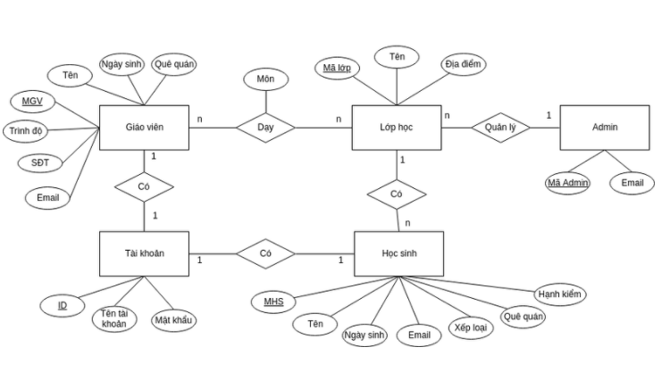
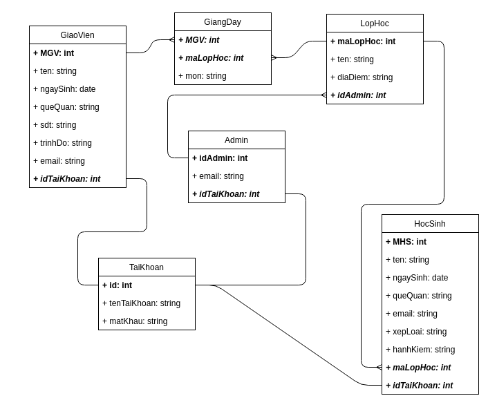

# Những bước cơ bản để xây dựng lên một cơ sở dữ liệu
Xây dựng cở sở dữ liệu là một trong những bước vô cùng quan trọng khi bạn xây dựng bất cứ 1 chương trình nào.
Đây cũng là điều kiện tiên quyết cho sự thuận lợi cũng như chuẩn xác mà chương trình mà bạn sẽ viết hay sự phát triển, mở rộng của hệ thông sau này.
Chúng ta hãy đi vào bài toán cụ thể, làm về chương trình `Hệ thống quản lí học tập`:
- Một người dùng có thể đăng ký, đăng nhập, đăng xuất một tài khoản duy nhất.
- Admin có thể tạo, sửa, xoá lớp học đó.
- Mỗi Admin có thể quản lí những lớp của mình tạo ra.
- Admin có thể thêm học sinh, giáo viên vào mỗi lớp học, và mỗi lớp học có thể có nhiều giáo viên giảng dạy.
- Mỗi giáo viên có thể tham gia dạy nhiều lớp, với 1 môn nào đó.
- Mỗi học sinh sẽ thuộc về một lớp nào đó.
- Mỗi người dùng có thể thêm, sửa, xóa thông tin của bản thân.
- Giáo viên có thể xem thông tin các lớp mình dạy, danh sách học sinh các lớp đó.
- Học sinh có thể xem thông tin các lớp mình học.
####Những lưu ý khi xây dựng DB:
#####1. Xác định bài toán
- Ở bước này từ các yêu cầu của bài toán, ta cần xác định hệ thống sẽ làm những gì, làm gì với những đối tượng nào.
  -  Các đối tượng chính:  Admin, giáo viên, học sinh
  -  Các chức năng chính:
     - Admin:
        - Thêm, sửa, xóa lớp học
        - Thêm học sinh, giáo viên vào lớp học
     - Giáo viên, học sinh:
        - Thêm, sửa, xóa thông tin cá nhân
        - Xem thông tin các lớp mình dạy(hoặc học) Từ bước này ta có cái nhìn tổng quan hơn về hệ thống, về chức năng của từng tác nhân cũng như hướng bạn sẽ phát triển hệ thống từ đâu.
#####2. Xây dựng mô hình thực thể - liên kết.
- Đây là bước xác định xem cơ sở dữ liệu của bạn có tốt hay không.
- Bước này cần xác định requirement của bài toán 
- Những chức năng đã được xác định
- Các thực thể của hệ thống là gì
- Quan hệ của chúng ra sao
######2.1 Xác định thực thể.
- Thực thể ở đây là các đối tượng trong thực tế như: Giáo viên, Học sinh, Admin, Lớp học, Tài khoản. Với mỗi thực thể đó hãy xác định thuộc tính của chúng.
  - Giáo viên: Mã giáo viên(MGV), Tên, Ngày sinh, Quê quán, Số điện thoại, Email, Trình độ giảng dạy
  - Học sinh: Mã học sinh(MHS), Tên, Ngày sinh, Quê quán, Địa chỉ, Số điện thoại, Email, Hạnh kiểm, Xếp loại
  - .......
######2.2 Xác định khoá chính
- Đối với mỗi đối tượng và các thuộc tính đó, bạn hãy xác định khoá chính của các đối tượng đó.
- Khoá chính có thể hiểu đơn giản là thuộc tính nhằm xác định ra 1 đối tượng là duy nhất.
#####2.3 Xác định quan hệ giữa các thực thể.
- Khi đã xác định được các thực thể và các thuộc tính của chúng, công việc tiếp theo sẽ là xác định ra quan hệ giữa các thực thể.
- Có các kiểu quan hệ như sau:
  - 1-1: Là quan hệ mà mỗi đối tượng này chỉ có 1 đối tượng kia và ngược lại: Giáo viên - tài khoản, Học sinh - tài khoản
  - 1-n: Là quan hệ mà mỗi đối tượng này có nhiều đối tượng khác nhưng không có chiều ngược lại: mỗi lớp học có nhiều học sinh.
  - n-n: Là quan hệ mà mỗi đối tượng này có nhiều đối tượng kia và ngược lại: mỗi giáo viên có nhiều lớp, và mỗi lớp có nhiều giáo viên
#####2.4 Vẽ mô hình thực thể - liên kết

- Mỗi thực thể là 1 hình chữ nhật, các thuộc tính là hình bầu dục, còn các quan hệ là giữa các thực thể là hình con thoi.
- Các khoá chính được đánh dấu bằng dấu gạch dưới. Các kiểu liên kết được viết trên các đường nối là các quan hệ.
- Từ hình vẽ này ta có cái nhìn tổng quát về quan hệ toàn hệ thống.
####3. Chuyển từ mô hình thành quan hệ dạng bảng.
- Đối với mỗi kiểu liên kết, ta có kiểu liên kết giữa các bảng khác nhau:
    - 1-1: Chúng ta sẽ liên kết các bảng này bằng cách thêm các khoá chính của 1 bảng vào các bảng còn lại. Ví dụ: Quan hệ của Học sinh - Tài khoản là 1-1 : 
        - TaiKhoan = { ID, tenTaiKhoan, matKhau }
        - HocSinh = { MHS, ten, ..., idTaiKhoan}
    - Thông thường bảng được thêm trường là bảng mà mang ý nghĩa thuộc về đối tượng của bảng còn lại mặc dù ta có thể làm ngược lại.
    - 1-n: Ta sẽ thêm khoá chính vào bảng đại diện cho quan hệ nhiều nhiều. Ví dụ quan hệ của lớp học - học sinh là 1-n:
        - LopHoc = { maLop, ten, diaDiem }
        - HocSinh = { MHS, ten, ..., maLop }
    - n-n: Ta có thể thêm 1 bảng mới có chứa cả 3 khoá chính của 2 bảng có quan hệ n-n. Ta cũng có thể thêm thuộc tính vào các mối quan hệ này.
   Ví dụ như giáo viên - lớp học là n - n:
        - LopHoc = { maLop, ten, diaDiem }
        - GiaoVien = { MGV, ten, ngaySinh, queQuan, email, sdt, trinhDo }
        - GiangDay = { maLop, MGV, mon }
- Như vậy ta có các bảng với các mối quan hệ tương ứng như sau:

