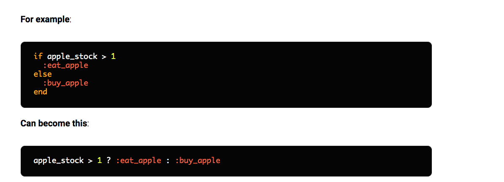

# Cách sử dụng toán tử ba ngôi (?:)

1. Khái niệm
-   Là toán tử được hình thành bởi ba thành phần: gồm điều kiện và hai kết qủa có thể xảy ra

-   Bất cứ mã nào cũng có thể chạy nếu điều kiện trở thành `đúng`. Kết quả đầu tiên lúc nào cũng có thể xảy ra, sau dấu (**:**)  là một phần tử cú pháp khác. Nếu điều kiện của bạn là sai thì kết quả thứ 2 có thể xảy ra. 

```.env
    "chocolate".size > 4 ? "More than four characters" : "Less than four characters"
```
-   Ba phần này là các thành phần của mọi biểu thức toán tử ba ngôi
    -   Điều kiện --> "chocolate".size > 4
    -   Nếu đúng --> "More than four characters"
    -   Nếu sai --> "Less than four characters"
-   Bạn có thể gán kết quả của toán tử ba ngôi cho 1 biến
```.env
    a = 10 > 5 ? "Yes" : "No"
```
-   Chúng ta có thể sử dụng dấu ngoặc khi kết quả của điều kiện có khoảng trống trong đó.Nếu không sử dụng dấu () bạn sẽ gặp lỗi ``SyntaxError``
```.env
    10 > 5 ? (puts "yes") : (puts "no")
```

# ---- The end ----
